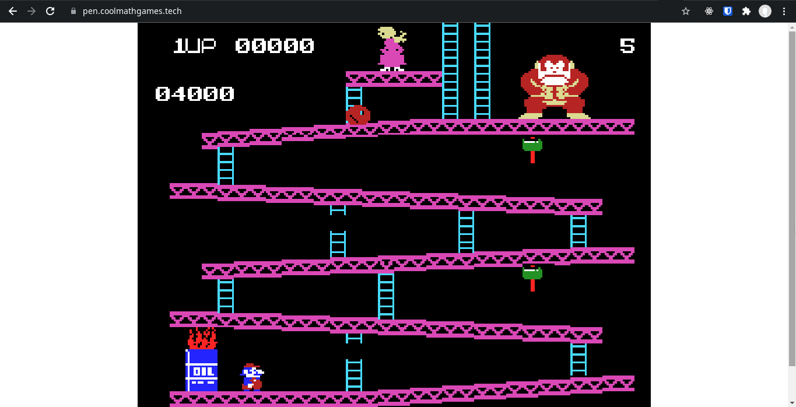

# Pen



Pen is a ColecoVision emulator written using AssemblyScript / TypeScript which runs in WebAssembly!
Pen is written entirely from scratch, including the CPU emulator!
It's a little buggy at the moment and doesn't have support for all the graphics modes,
but it's able to play a few retail games!

## Setup

Clone the repo:
```
git clone git@github.com:/mstrodl/pen
```
Install dependencies:
```
pnpm i
```

Place ColecoVision BIOS in `./roms/bios.col`
Add a default game rom to `./roms/dk.col`

Build emulator:
```
pnpm run asbuild:optimized
```
Build frontend:
```
node_modules/.bin/parcel build index.html
```
Emulator should be in `dist/` directory and ready to be served!

## TODO

- More video modes need to be implemented
- Donkey Kong can crash on level 3
- Donkey Kong has flickering issues
- A few IX/IY ops are yet unimplemented
